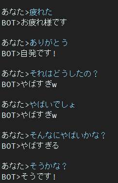

# Dialog
Dialog is japanese chatbot project.  
Seq2Seq model has BERT Encoder and Transformer Decoder.

Note that this seq2seq model cannot use conversation history.  
Hence if you wanna train the model that can consider long-dependency about conversation,
I encourage to use RNN base model.  
But I think Recurrence mechanism found in Transformer-XL may help to acquire long-dependency.  
If you have the solution about this, please write in issues.

I started training in (12/9/2019) with 1 GTX1080Ti.  
In training, I'm able to use 256 batch size with 12 token.

[Article](https://qiita.com/reppy4620/items/e4305f22cd8f6962e00a) written in Japanese.

# Result
20epochs



This model has still contain the problem about dull response.  
To solve this problem i'm researching now.  

Then I found the paper tackled this problem.

[Another Diversity-Promoting Objective Function for Neural Dialogue Generation](https://arxiv.org/abs/1811.08100)

Authors belong to the Nara Institute of Science and Technology a.k.a NAIST.  
They propose the new object function of Neural dialogue generation.  
I hope that this method can help me to solve that problem.  

# Usage
### Install packages.  
```bash
$ pip install -r requirements.txt
```
requirements.txt includes redundant packages.  
Mainly needed packages are

- pytorch
- huggingface/transformers
- sentencepiece
- tqdm

If occur errors because of package, please install missing package.

### Download Pretrained model
Download -> [Pretrained BERT model and trained SentencePiece model](https://drive.google.com/open?id=1p_Pxmhn-sIrdtaVIM3-8YtbIiztSQE55)  
and change path in config.py

### Prepare conversation data.  

- I used twitter data that is scraped using [this](https://qiita.com/gacky01/items/89c6c626848417391438)

- Normalized sentence(e.g. remove punctuations...) and encode to ids using SentencePiece.

- Convert to pkl from sentence pair  
```
# architecture
# q is input sentence, a is target sentence.
[(q1, a1), (q2, a2), (q3, a3), ...]
```
I think you don't feel like collecting data.
So I open the traing data to the public.

training data:  [this](https://drive.google.com/open?id=1VAL11Bv0sTo05x4ZeYpW7WXCWLkdwiJW)  
Please use pkl data if you wanna train.
- Change path in config.py

- start training

# Architecture
- Encoder: BERT-[arxiv](https://arxiv.org/abs/1810.04805)  
- Decoder: Vanilla Transformer Decoder-[arxiv](https://arxiv.org/abs/1706.03762)

- Loss: KLDivLoss with LabelSmoothing
- Optimizer: Adam with warm-up

- Tokenizer: SentencePiece(trained wiki-japanese)

Idea of Loss and Optimizer comes from The Annotated Transformer i denote below.

If you want more information about architecture of BERT or Transformer, please refer to the following blog.

- [The Annotated Transformer](http://nlp.seas.harvard.edu/2018/04/03/attention.html)
- [The Illustrated Transformer](http://jalammar.github.io/illustrated-transformer/)
- [PyTorch-Transformers/modeling_bert](https://github.com/huggingface/pytorch-transformers/blob/master/pytorch_transformers/modeling_bert.py)
